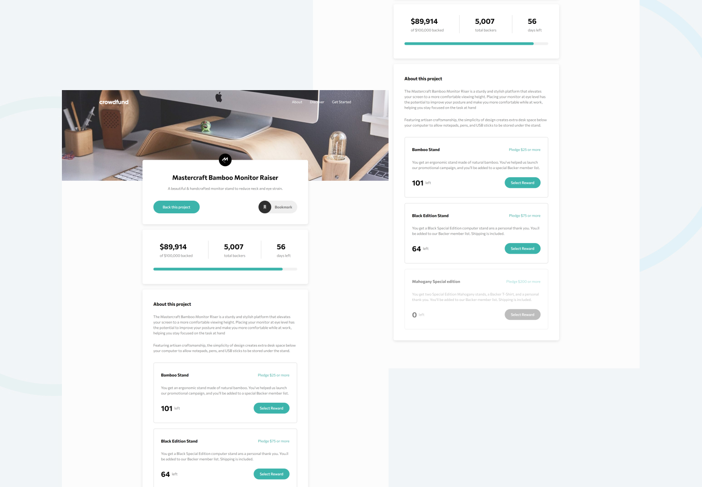

# Frontend Mentor - Crowdfunding product page solution

This is a solution to the [Crowdfunding product page challenge on Frontend Mentor](https://www.frontendmentor.io/challenges/crowdfunding-product-page-7uvcZe7ZR). Frontend Mentor challenges help you improve your coding skills by building realistic projects. 

## Table of contents

- [Overview](#overview)
  - [The challenge](#the-challenge)
  - [Screenshot](#screenshot)
  - [Links](#links)
- [My process](#my-process)
  - [Built with](#built-with)
  - [What I learned](#what-i-learned)
  - [Continued development](#continued-development)
  - [Useful resources](#useful-resources)
- [Author](#author)

## Overview

### The challenge

Users should be able to:

- View the optimal layout depending on their device's screen size
- See hover states for interactive elements
- Make a selection of which pledge to make
- See an updated progress bar and total money raised based on their pledge total after confirming a pledge
- See the number of total backers increment by one after confirming a pledge
- Toggle whether or not the product is bookmarked

### Screenshot

### Links

- Solution URL: (https://github.com/arbaiv/crowdfunding-product-page-challenge)
- Live Site URL: (https://genuine-centaur-e9d448.netlify.app/)

## My process

### Built with

- Semantic HTML5 markup
- CSS custom properties
- Flexbox
- CSS Grid
- Mobile-first workflow
- JavaScript

### What I learned

- :has pseudo-class and how useful it is
- a11y-dialog script to create accessible dialogs 
- Dialog element in html
- ::backdrop pseudo-element 
- Animate elements with display:none property 
- Customize and animate Radio Inputs
- Hide scrollbar but keep their functionality
- .toLocaleString() method

### Continued development

After learning advance JS Es6 concepts, this project has helped me a lot to improve and implement what I have learned so far. Will be doing more challenging projects from now on.

### Useful resources
- [Resource 1](https://www.youtube.com/watch?v=OGJvhpoE8b4&t=1s&ab_channel=KevinPowell) - :has pseudo-class and how useful it is
- [Resource 2](https://a11y-dialog.netlify.app/) - a11y-dialog script to create accessible dialogs 
- [Resource 3](https://www.youtube.com/watch?v=TAB_v6yBXIE&t=67s&ab_channel=KevinPowell) - Dialog element in html
- [Resource 4](https://css-tricks.com/almanac/selectors/b/backdrop/) - ::backdrop pseudo-element
- [Resource 5](https://moderncss.dev/pure-css-custom-styled-radio-buttons/) - Customize and animate Radio Inputs
- [Resource 6](https://www.w3schools.com/howto/howto_css_hide_arrow_number.asp) - Hide arrows from number input
- [Resource 7](https://www.w3schools.com/howto/howto_css_hide_scrollbars.asp) - Hide scrollbars but keep functionality
- [Resource 8](https://www.geeksforgeeks.org/how-to-create-a-gradient-shadow-using-css/) - How to create gradient shadow. I used this method to add the gradient shadow or backdrop behind the mobile navbar.
- [Resource 9](https://stackoverflow.com/questions/18510845/maxlength-ignored-for-input-type-number-in-chrome) - How to put maxlength attribute in type inputs and add functionality to it.
- [Resource 10](https://stackoverflow.com/questions/2901102/how-to-print-a-number-with-commas-as-thousands-separators-in-javascript) - How to return a number with commas as thousands separators in JavaScript

## Author

- LinkedIn - [Abdur Rahaman](https://www.linkedin.com/in/abdur-rahaman-arb4/)
- Github - [@arbaiv](https://github.com/arbaiv)
- Twitter - [@arbaiv](https://twitter.com/arbaiv)
- Frontend Mentor - [@arbaiv](https://www.frontendmentor.io/profile/arbaiv)